<p align="center">
  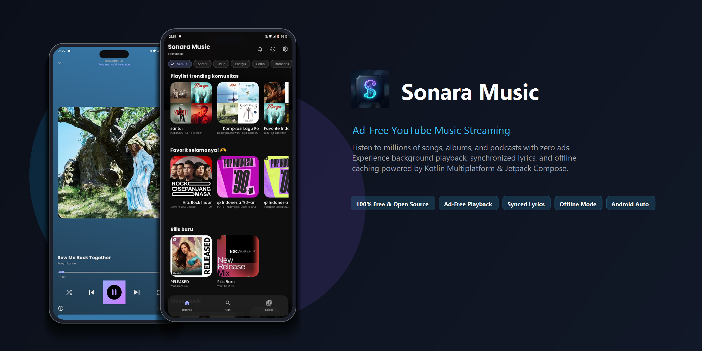
</p>

# Sonara Music

A clean, ad-free music streaming app for Android and Web powered by YouTube Music. Built with Kotlin Multiplatform and Jetpack Compose.

[](https://github.com/saferill/Music-App/releases)
[](LICENSE)
[](https://alternativeto.net/software/sonara-music/about/?utm_source=badge&utm_medium=referral)

<a href="https://alternativeto.net/software/sonara-music/about/?utm_source=badge&utm_medium=referral" target="_blank">
  
</a>

## Screenshots

<p align="center">
  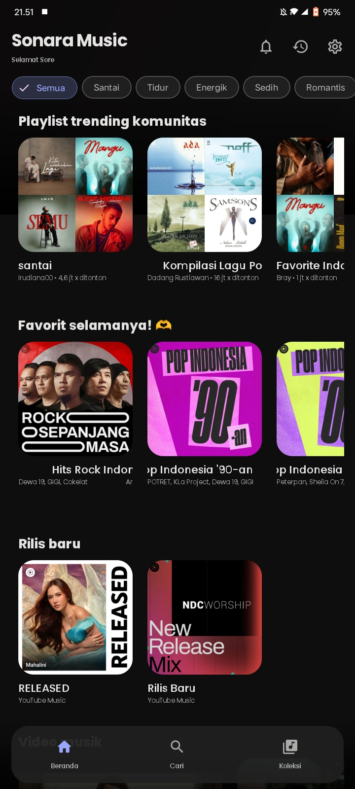
  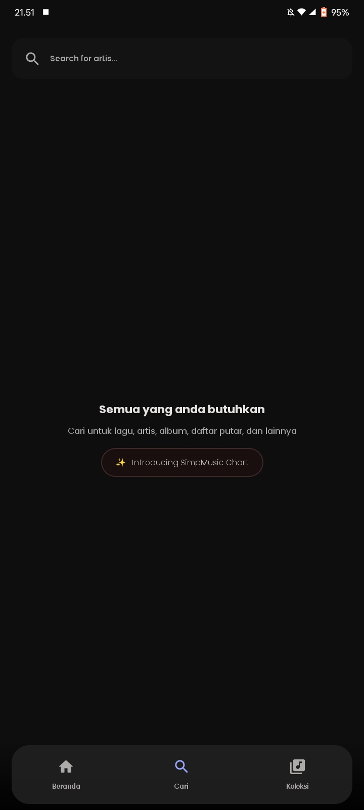
  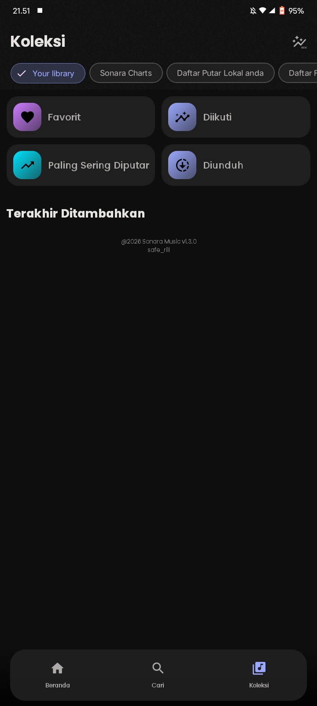
  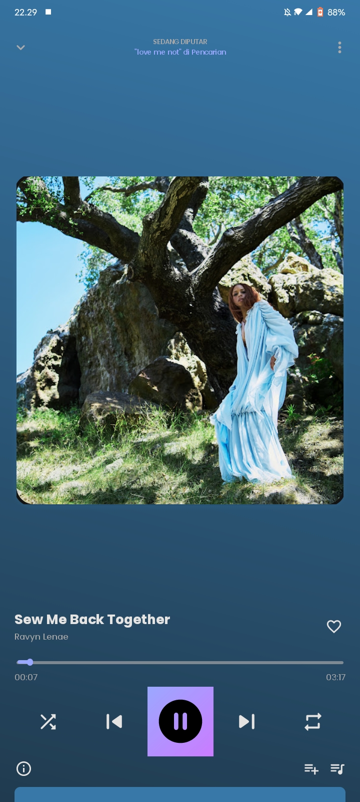
  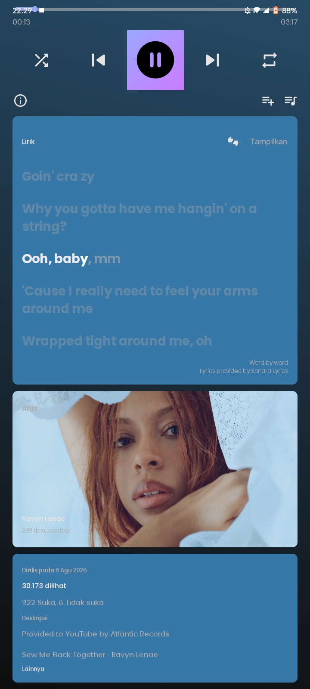
</p>
<p align="center">
  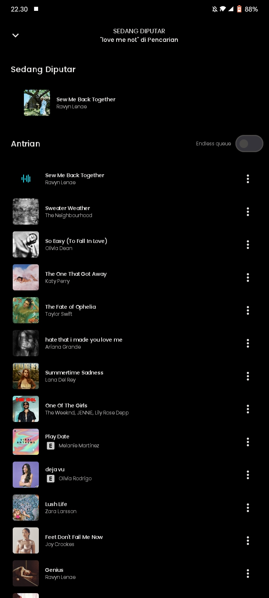
  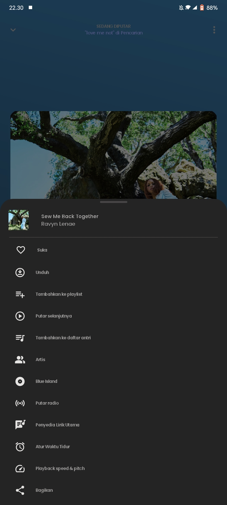
  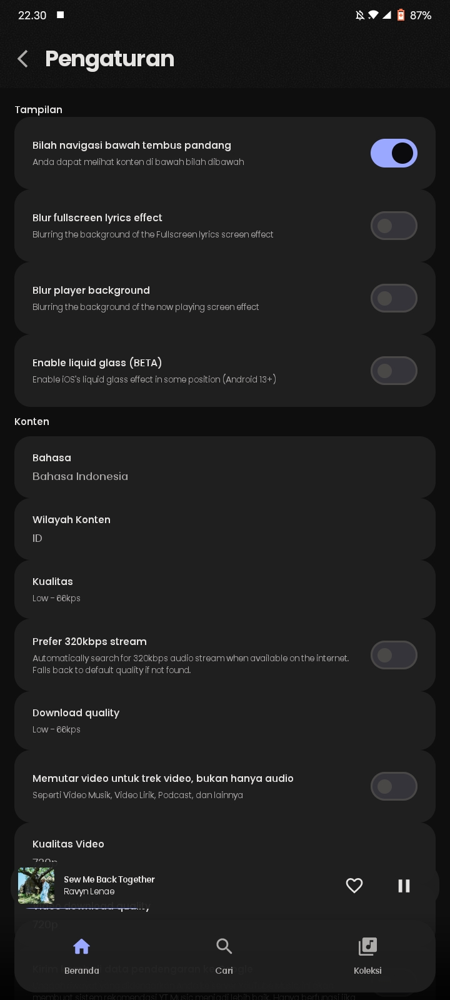
  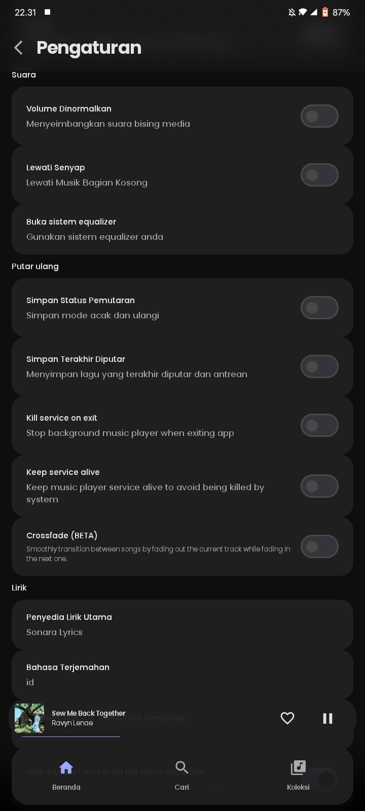
  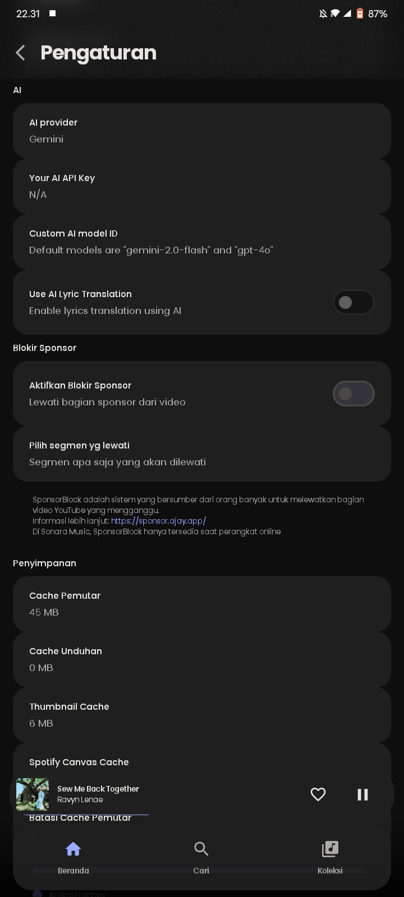
</p>

## Features

- **Ad-Free Playback:** Stream music and videos from YouTube Music without ads.
- **Background & Lock Screen:** Full media notification controls, sleep timer, and Android Auto.
- **Synced Lyrics:** Real-time synchronized lyrics support.
- **Offline Mode:** Download and cache tracks for offline listening.
- **Audio Tuning:** Volume normalization, equalizer support, and skip silence.
- **SponsorBlock:** Automatically skip sponsor segments.
- **Privacy:** No tracking, your library and history are stored locally.

## Download

Grab the latest APK from the [Releases](https://github.com/saferill/Music-App/releases) page:
- `androidApp-arm64-v8a-release.apk` (Recommended for most devices)
- `androidApp-armeabi-v7a-release.apk` (32-bit devices)
- `androidApp-universal-release.apk` (All architectures)

## Building from Source

```bash
# Clone the repository
git clone https://github.com/saferill/Music-App.git
cd Music-App

# Build release APK
./gradlew :androidApp:assembleRelease
```

## License

This project is licensed under the [GNU General Public License v3.0](LICENSE).
